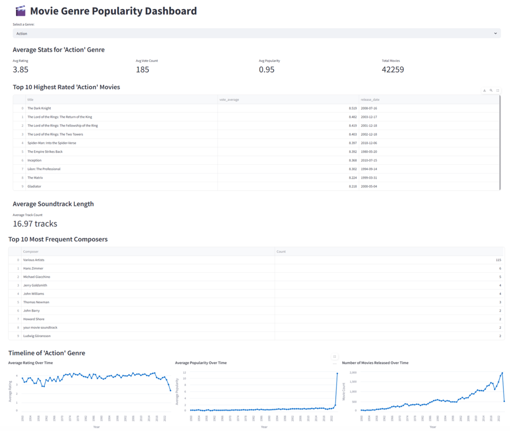
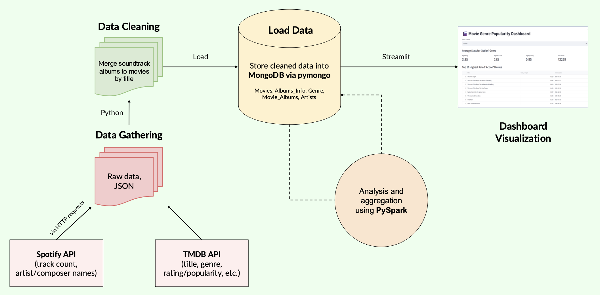

# Movie-Soundtrack ETL Analysis

  

## Description
This project explores how soundtrack characteristics, such as popularity, length, and composer, impact a movie's ratings and success. We extracted data from the Spotify and TMDB APIs, stored it in MongoDB, analyzed it using PySpark, and built an interactive Streamlit dashboard for user exploration.

## Tools and Technologies Used
- Spotify API: Fetch soundtrack metadata (track count, composer, album popularity)
- TMDB API: Retrieve movie ratings, genre, popularity, and release year
- MongoDB: Store and manage raw and cleaned data (JSON format)
- PySpark: Analyze relationships across genres, time series, and composer trends
- Streamlit: Create interactive dashboard for visualization
- Pymongo: Interface MongoDB with Python

## Data Pipeline Overview
1. Fetch data from TMDB and Spotify APIs
2. Merge movie and soundtrack metadata using custom cleaning scripts
3. Store cleaned data into MongoDB (collections: Movies, Albums_Info, Genres, Artists)
4. Analyze data with PySpark for genre-wise trends, composer analysis, and correlations
5. Build Streamlit dashboard to visualize average ratings, soundtrack count, and top composers per genre

## Project Workflow

  

## Key Features
- Genre Analysis: View average soundtrack quantity and movie rating by genre
- Composer Insights: Discover top composers and their associated genres
- Time Series Trends: Explore how genre popularity and soundtrack usage have evolved
- Interactive Visuals: Filter dashboard by genre, time period, or popularity

  

## Challenges and Limitations
- Spotify API rate limits and missing popularity variables created data gaps
- Merging Spotify and TMDB data required heavy cleaning due to inconsistent structure
- Analysis was limited to metadata; no actual music content was used
- Some research questions were dropped due to variable limitations and memory issues during large-scale processing on Google Colab

## Conclusion
Through this group project, we demonstrated how external data sources like Spotify and TMDB can be integrated into an end-to-end ETL pipeline to uncover insights about movie and soundtrack dynamics. Our dashboard allows film studios and analysts to explore genre-specific trends and composer patterns that may inform future music licensing or promotion strategies.
